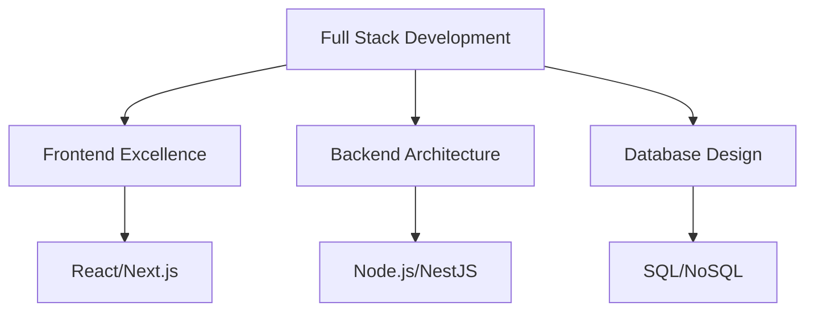

<div align="center">
  
</div>

<div align="center">
  
</div>

<br/>

<div align="center">
  
  [](https://github.com/dav-icode)
  [](https://github.com/dav-icode?tab=followers)
  [](https://github.com/dav-icode?tab=repositories)
  
</div>

<!-- Animated Line -->


<br/>

##  **About Me**

[](https://raw.githubusercontent.com/abhisheknaiidu/abhisheknaiidu/master/code.gif)

```typescript
const daviProfile = {
    name: "Davi Franco Cosinha",
    age: 18,
    location: "São Paulo, Brazil",
    education: "Análise e Desenvolvimento de Sistemas",
    role: "Fullstack Developer",
    
    expertise: {
        frontend: ["React", "Next.js", "Angular", "TypeScript"],
        backend: ["Node.js", "Nest.js", "Python", "REST APIs"],
        database: ["PostgreSQL", "MySQL", "MongoDB"],
        tools: ["Git", "Docker", "ERPs", "CI/CD"]
    },
    
    currentFocus: "Expanding UI/UX frameworks & System Architecture",
    sharing: "@_frnq0 on Instagram",
    philosophy: "Always learning, always evolving! "
};
```

<br clear="right"/>

##  **Connect with Me**

<div align="center">
  
  [](https://www.youtube.com/@dav1code)
  [](https://www.instagram.com/_frnq0)
  [](https://www.linkedin.com/in/davi-franco-cosinha-731496340/)
  [](mailto:davi.fcosinha@gmail.com)
  [](https://github.com/dav-icode)
  
</div>

<br/>

##  **Tech Stack**

<div align="center">

###  **Frontend Development**


### ⚙ **Backend Development**


###  **UI Frameworks**


### 🗄 **Database & Cloud**


###  **DevOps & Tools**


</div>

<br/>

##  **GitHub Analytics**

<div align="center">
  
  
</div>

<div align="center">
  
</div>

<br/>

##  **Contribution Graph**

<div align="center">
  
</div>

<br/>

##  **GitHub Trophies**

<div align="center">
  
</div>

<br/>

## 💻 **Current Projects & Focus**

<div align="center">
  
|  **Area** |  **Currently Learning** |  **Goals** |
|-------------|---------------------------|--------------|
| **Frontend** | Advanced React Patterns, Micro-frontends | Build scalable UI architectures |
| **Backend** | Microservices, GraphQL, gRPC | Design distributed systems |
| **DevOps** | Kubernetes, AWS, Terraform | Automate everything |
| **Mobile** | React Native, Flutter | Cross-platform development |

</div>

<br/>

## 📝 **Latest Activity**

<!--START_SECTION:activity-->

<!--END_SECTION:activity-->

<br/>

## 💭 **Dev Quote**

<div align="center">
  
</div>

<br/>

##  **2025 Goals**

-  Master advanced microservices architecture
-  Deploy 3+ production mobile applications  
-  Contribute to major open-source projects
-  Share knowledge through technical articles
-  Complete cloud certifications (AWS/Azure)
-  Build innovative solutions that impact lives

<br/>

<div align="center">
  
###  **"Code is poetry, and I'm writing my masterpiece"** 

</div>

<!-- Snake animation -->
<div align="center">
  
</div>

<!-- Footer -->
<div align="center">
  
</div>

<div align="center">
  <b>Thanks for visiting! Let's connect and build something amazing together! </b>
</div>
